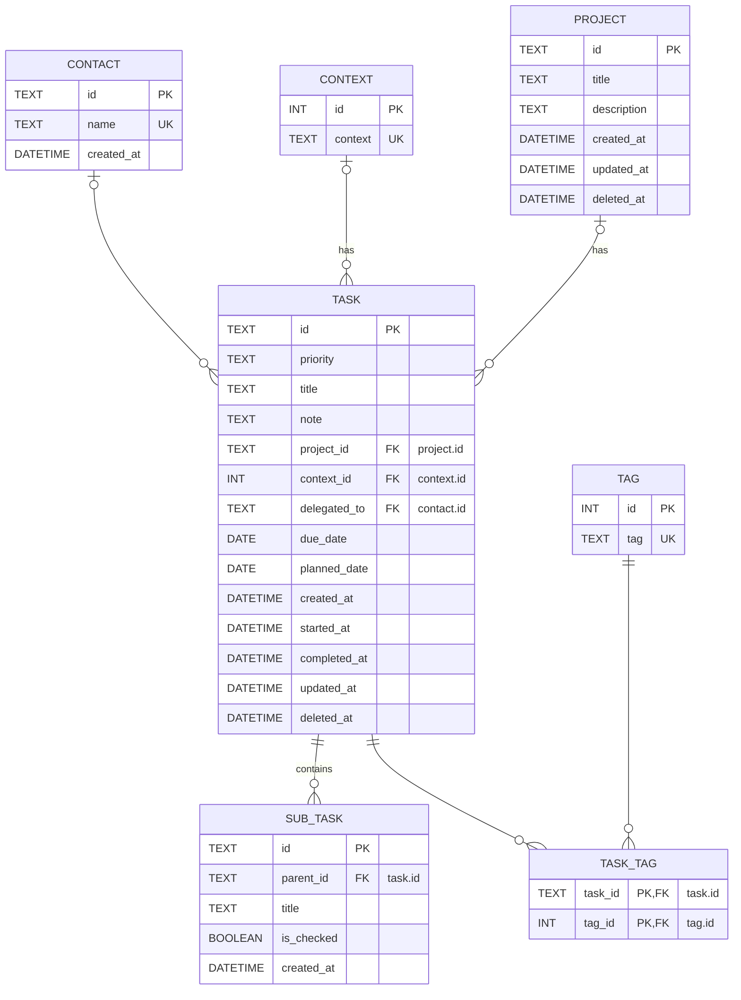

# Database Documentation

SQLite

## About ID

According to the [Nano ID Collision Calculator](https://zelark.github.io/nano-id-cc/),
15 characters can generate up to 4T IDs.

## ER Diagram

## Schema

Alphabetical

### contact

| Name       | Type     | Settings         | References          | Default Value     | Notes |
| ---------- | -------- | ---------------- | ------------------- | ----------------- | ----- |
| id         | TEXT     | PK               | > task.delegated_to |                   |       |
| name       | TEXT     | NOT NULL, UNIQUE |                     |                   |       |
| created_at | DATETIME | NOT NULL         |                     | CURRENT_TIMESTAMP |       |

### context

| Name    | Type | Settings         | References        | Default Value | Notes |
| ------- | ---- | ---------------- | ----------------- | ------------- | ----- |
| id      | INT  | PK               | > task.context_id | AUTOINCREMENT |       |
| context | TEXT | NOT NULL, UNIQUE |                   |               |       |

### project

| Name        | Type     | Settings | References        | Default Value     | Notes                                |
| ----------- | -------- | -------- | ----------------- | ----------------- | ------------------------------------ |
| id          | TEXT     | PK       | > task.project_id |                   | Nano ID CHECK(length(id) == 15) |
| title       | TEXT     | NOT NULL |                   |                   |                                      |
| description | TEXT     |          |                   |                   |                                      |
| created_at  | DATETIME | NOT NULL |                   | CURRENT_TIMESTAMP |                                      |
| updated_at  | DATETIME | NOT NULL |                   | CURRENT_TIMESTAMP |                                      |
| deleted_at  | DATETIME |          |                   |                   |                                      |

### sub_task

| Name       | Type     | Settings     | References | Default Value     | Notes                                |
| ---------- | -------- | ------------ | ---------- | ----------------- | ------------------------------------ |
| id         | TEXT     | PK           |            |                   | Nano ID CHECK(length(id) == 15) |
| parent_id  | TEXT     | FK, NOT NULL | task.id <  |                   |                                      |
| title      | TEXT     | NOT NULL     |            |                   |                                      |
| is_checked | BOOLEAN  | NOT NULL     |            | 0                 |                                      |
| created_at | DATETIME | NOT NULL     |            | CURRENT_TIMESTAMP |                                      |

### tag

| Name | Type | Settings         | References        | Default Value | Notes |
| ---- | ---- | ---------------- | ----------------- | ------------- | ----- |
| id   | INT  | PK               | > task_tag.tag_id | AUTOINCREMENT |       |
| tag  | TEXT | NOT NULL, UNIQUE |                   |               |       |

### task

| Name         | Type     | Settings | References                                  | Default Value     | Notes                                |
| ------------ | -------- | -------- | ------------------------------------------- | ----------------- | ------------------------------------ |
| id           | TEXT     | PK       | > sub_task.parent_id > task_tag.task_id |                   | Nano ID CHECK(length(id) == 15) |
| priority     | TEXT     |          |                                             |                   | CHECK(priority GLOB '[A-Z]')         |
| title        | TEXT     | NOT NULL |                                             |                   |                                      |
| note         | TEXT     |          |                                             |                   |                                      |
| project_id   | TEXT     | FK       | project.id <                                |                   |                                      |
| context_id   | INT      | FK       | context.id <                                |                   |                                      |
| delegated_to | TEXT     | FK       | contact.id <                                |                   |                                      |
| due_date     | DATE     |          |                                             |                   | deadline                             |
| planned_date | DATE     |          |                                             |                   |                                      |
| created_at   | DATETIME | NOT NULL |                                             | CURRENT_TIMESTAMP |                                      |
| started_at   | DATETIME |          |                                             |                   |                                      |
| completed_at | DATETIME |          |                                             |                   |                                      |
| updated_at   | DATETIME | NOT NULL |                                             | CURRENT_TIMESTAMP |                                      |
| deleted_at   | DATETIME |          |                                             |                   |                                      |

### task_tag

| Name    | Type | Settings | References | Default Value | Notes |
| ------- | ---- | -------- | ---------- | ------------- | ----- |
| task_id | TEXT | PK, FK   | task.id <  |               |       |
| tag_id  | INT  | PK, FK   | tag.id <   |               |       |

## References

- [DBML - Database Markup Language](https://dbml.dbdiagram.io/home/)
- [dbdocs.io - Database Documentation and Catalog Tool](https://dbdocs.io)
- [Entity Relationship Diagrams | Mermaid](https://mermaid.js.org/syntax/entityRelationshipDiagram.html)
- [Mermaid Live Editor](https://mermaid.live/)
- [todo.txt format rules | GitHub](https://github.com/todotxt/todo.txt?tab=readme-ov-file#todotxt-format-rules)
- [The Getting Things Done process](<https://prismic-io.s3.amazonaws.com/float-com/294d0abf-23a8-4475-adf2-045fc1ca6265_The+Getting+things+done+process+(1).png>)
- [Three Ways To Think About Prioritization](https://success.oregonstate.edu/sites/success.oregonstate.edu/files/LearningCorner/Tools/prioritize_-_3_methods_20.pdf)
